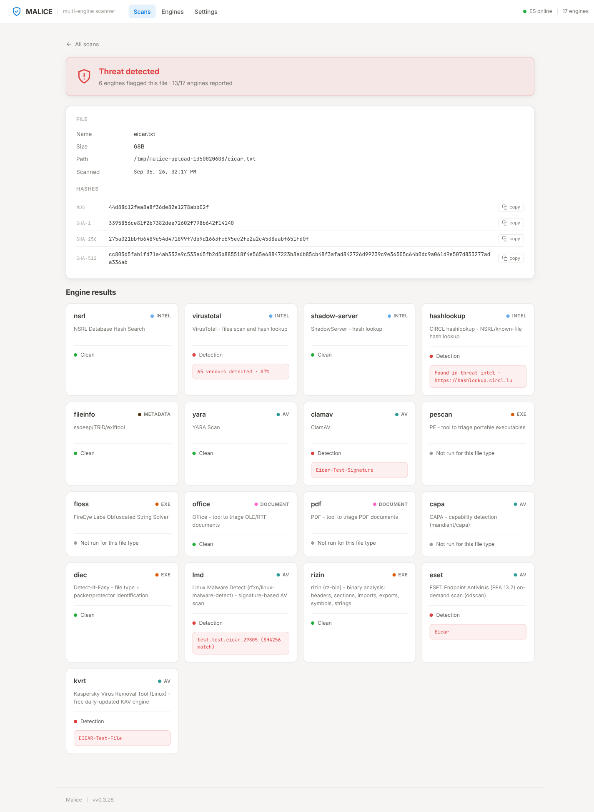
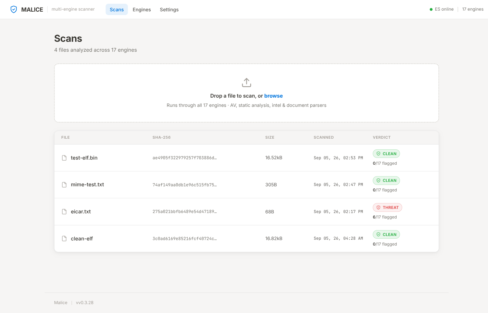
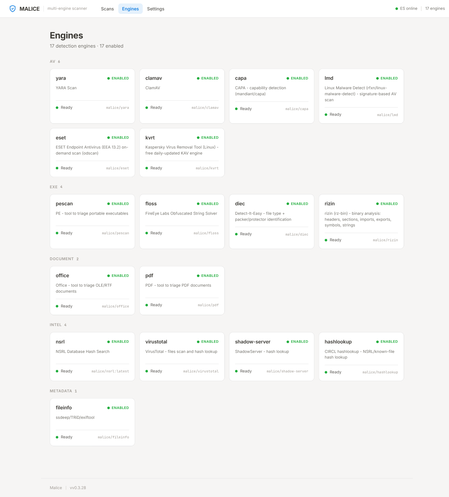
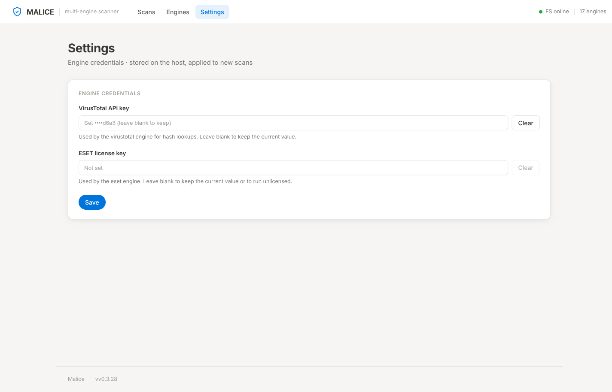

# Malice

A free, open-source, multi-engine malware scanner. Malice orchestrates a fleet of
antivirus and analysis engines in Docker, runs them all against a single file, and
stores the combined results in Elasticsearch. It is a self-hosted VirusTotal: your
files never leave your machine.

[](LICENSE)



## Why

Malice is a free, open-source alternative to VirusTotal that anyone can run, from an
independent researcher to a security team, without sending files to a third party.

## What changed

The original project (github.com/maliceio/malice) was abandoned after its last release
in 2019. It targeted Docker 17 and Elasticsearch 6, and its engine fleet leaned on
commercial AV products that no longer ship free Linux CLIs. The engine images on Docker
Hub were last pushed in 2019, and the build system (Dep) no longer works.

This is a rebuild of the same idea on current infrastructure:

- Docker SDK 29 (was 17.10), Docker Compose v2
- Elasticsearch 8 (was 6.5), same `malice` index and document shape
- 17 engines, all rebuilt from source and verified end to end. The 14 commercial AV
  engines from the original roster are gone (none offers a free Linux CLI anymore);
  they are replaced with live free tools: ClamAV, ESET EEA 13.2, Kaspersky KVRT,
  Linux Malware Detect, CAPA, YARA, FLOSS, rizin, DIE, and more
- A web UI and a REST API (the original had neither)
- One-command deployment with `deploy.sh`
- Signature updates handled automatically (see Updates)

## How it works

Malice is a thin Go client. It does not run any AV engine itself. For each file it:

1. Hashes the file (MD5 / SHA-1 / SHA-256 / SHA-512).
2. Copies it into a Docker volume.
3. Runs every enabled engine that supports the file MIME type as an isolated Docker
   container, plus a set of hash-lookup "intel" engines.
4. Collects each engine JSON result and stores one scan document in Elasticsearch.

The result is one document per file: file metadata + hashes, and a per-engine result tree.

## Engines

17 engines across 6 categories:

| Category   | Engine        | What it does |
|------------|---------------|--------------|
| av         | capa          | CAPA, capability detection (mandiant/capa) |
| av         | clamav        | ClamAV |
| av         | eset          | ESET Endpoint Antivirus (EEA 13.2) on-demand scan |
| av         | kvrt          | Kaspersky Virus Removal Tool (Linux) |
| av         | lmd           | Linux Malware Detect (signature-based) |
| av         | yara          | YARA rule scan |
| document   | office        | Triage OLE/RTF documents |
| document   | pdf           | Triage PDF documents |
| exe        | diec          | Detect-It-Easy, file type + packer/protector ID |
| exe        | floss         | FireEye FLOSS, obfuscated string solver |
| exe        | pescan        | Triage portable executables (PE) |
| exe        | rizin         | rizin (rz-bin), headers, sections, imports, exports, strings |
| intel      | hashlookup    | CIRCL hashlookup, NSRL/known-file lookup |
| intel      | nsrl          | NSRL database hash search |
| intel      | shadow-server | ShadowServer hash lookup |
| intel      | virustotal    | VirusTotal file scan + hash lookup (needs API key) |
| metadata   | fileinfo      | ssdeep / TRiD / exiftool |

AV engines report a positive detection. `intel` engines report whether the hash is
known. `document`, `exe`, and `metadata` engines report analysis, not a threat verdict.

## Deploy

### One command

```bash
git clone https://github.com/rufftruffles/malice.git
cd malice
sudo ./deploy.sh
```

Minimum spec: 4 cores, 8 GB RAM, 80 GB free disk. The script installs Docker if it
is missing, pulls the server image, all 17 engine images, and Elasticsearch from GHCR,
starts the stack, opens port 3993 in ufw if the firewall is active, and prints the URL.

The compose file mounts `/var/run/docker.sock` because the server talks to the Docker
daemon to orchestrate the engine containers.

### Docker Compose (manual)

```bash
docker compose up -d
# UI + API: http://localhost:3993
```

## Updates

- **ESET** refreshes its signatures on every scan: the engine entrypoint runs
  `upd -u` at container start. No rebuild needed.
- **clamav, kvrt, yara, lmd** fetch their signature and rule sets at build time, so
  they are rebuilt nightly on the build host and pushed to GHCR. A client that ran
  `deploy.sh` picks them up automatically: a systemd timer re-pulls those four images
  daily at 04:52.
- The remaining engines are static tools with no decaying state.

## API keys

Both optional engines are configured in the web UI under **Settings** (or via
environment variables before the first scan):

- **VirusTotal** needs a free v3 API key. Without one, the engine reports "Skipped".
- **ESET** runs without a license using the bundled signatures, which are stale. Paste
  a trial or commercial license key into the Settings page and the engine activates on
  the next scan. Trial keys are obtained from ESET's website; they cannot be
  auto-acquired. The public image ships without any baked-in license.

## CLI

```bash
malice scan <file>          # scan a file with all enabled engines
malice plugin list          # list engines
malice plugin install <e>   # pull an engine image
malice lookup <hash>        # run the intel engines against a hash
malice serve --port 3993    # start the web UI + REST API
```

## REST API

| Method | Path                  | Description |
|--------|-----------------------|-------------|
| GET    | /api/health           | Service + ES health, engine count |
| GET    | /api/scans?from&size  | List scans (newest first) |
| GET    | /api/scans/:id        | Full scan document + per-engine results |
| POST   | /api/scans            | Upload a file (multipart `file`) and start a scan |
| GET    | /api/plugins          | List engines |
| GET    | /api/settings         | Engine credentials (masked) |
| POST   | /api/settings         | Set engine credentials |

## Web UI

A dependency-free single-page app served at `/`. The Scans page lists past scans,
takes file uploads, and drills into any scan: verdict, file metadata and hashes,
and the per-engine result grid. The Engines page shows the full roster grouped by
category, with image readiness. The Settings page views and sets the VirusTotal
and ESET credentials (masked).







## Development

```bash
make build   # embed config + build malice-bin
make test    # run tests
make lint    # go vet + gofmt
make ci      # lint + test
```

### Building from source

Malice depends on `github.com/malice-plugins/pkgs` (shared Elasticsearch + Docker
helpers). The upstream module is gone from GitHub, so the `go.mod` replace points at
the maintained fork:

```
replace github.com/malice-plugins/pkgs => github.com/rufftruffles/malice-plugins v1.0.1
```

A fresh clone builds with no sibling checkout: `go mod tidy && go build ./...`.
Engine images build the same way; each engine repo resolves the fork at build time.

## License

Apache 2.0, see [LICENSE](LICENSE).
